# microservices

A multi-service demo that shows how **kindling** handles a real-ish
microservice architecture — three backend services, a React dashboard,
two databases, and a Redis message queue, all deployed to your local
Kind cluster with zero manual wiring.

## Architecture

```mermaid
flowchart LR
    user(("👩‍💻 Developer"))

    subgraph cluster["⎈  Kind Cluster"]
        ingress["🔶 Ingress\n<user>-ui.localhost"]
        gw["🌐 Gateway\n:8080"]

        subgraph orders-stack["Orders Stack"]
            orders["📋 Orders\n:8081"]
            pg[("🐘 Postgres")]
            rd[("⚡ Redis\nQueue")]
        end

        subgraph inventory-stack["Inventory Stack"]
            inv["📦 Inventory\n:8082"]
            mongo[("🍃 MongoDB")]
        end

        ingress --> gw
        gw -- "/orders" --> orders
        gw -- "/inventory" --> inv
        orders -- "reads/writes" --> pg
        orders -- "LPUSH\norder.created" --> rd
        rd -- "BRPOP\norder.created" --> inv
        inv -- "reads/writes" --> mongo
    end

    user -- "http://<user>-ui.localhost" --> ingress

    style cluster fill:#0f3460,stroke:#326CE5,color:#e0e0e0,stroke-width:2px
    style orders-stack fill:#1a1a2e,stroke:#f0883e,color:#e0e0e0
    style inventory-stack fill:#1a1a2e,stroke:#2ea043,color:#e0e0e0
    style ingress fill:#FF6B35,stroke:#FF6B35,color:#fff
    style gw fill:#326CE5,stroke:#326CE5,color:#fff
    style orders fill:#f0883e,stroke:#f0883e,color:#fff
    style inv fill:#2ea043,stroke:#2ea043,color:#fff
    style pg fill:#336791,stroke:#336791,color:#fff
    style rd fill:#DC382D,stroke:#DC382D,color:#fff
    style mongo fill:#00684A,stroke:#00684A,color:#fff
    style user fill:#6e40c9,stroke:#6e40c9,color:#fff
```



### Services

| Service | Port | Database | Description |
|---|---|---|---|
| **ui** | 80 | — | React + TypeScript dashboard (Vite → nginx). Place orders, view inventory, watch activity. |
| **gateway** | 8080 | — | Public HTTP entry point. Proxies `/orders` and `/inventory` to backend services. |
| **orders** | 8081 | Postgres 16 | Manages orders. Publishes `order.created` events to a Redis queue. |
| **inventory** | 8082 | MongoDB | Manages product stock. Consumes `order.created` events and decrements stock. |

### Data flow

1. `POST /orders` → Gateway forwards to Orders service
2. Orders inserts a row into Postgres and `LPUSH`es an event onto the `order_events` Redis queue
3. Inventory's background worker `BRPOP`s the event and decrements stock in MongoDB
4. `GET /inventory` shows the updated stock levels

## Files

```
microservices/
├── .github/workflows/
│   └── dev-deploy.yml          # GitHub Actions workflow (uses kindling actions)
├── gateway/
│   ├── main.go                 # Reverse-proxy HTTP server
│   ├── Dockerfile
│   └── go.mod
├── orders/
│   ├── main.go                 # Orders API + Redis queue publisher
│   ├── Dockerfile
│   └── go.mod
├── inventory/
│   ├── main.go                 # Inventory API + Redis queue consumer
│   ├── Dockerfile
│   └── go.mod
├── ui/
│   ├── src/                    # React + TypeScript dashboard
│   ├── Dockerfile              # Vite build → nginx serve
│   ├── nginx.conf.template
│   └── package.json
├── deploy/                     # DevStagingEnvironment CRs (for manual deploy)
│   ├── orders.yaml
│   ├── inventory.yaml
│   ├── gateway.yaml
│   └── ui.yaml
└── README.md
```

## GitHub Actions Workflow

The included workflow uses the **reusable kindling actions** — each
build step is a single `uses:` call instead of 15+ lines of signal-file
scripting:

```yaml
# Simplified — see .github/workflows/dev-deploy.yml for the full file
steps:
  - uses: actions/checkout@v4

  - name: Clean builds directory
    run: rm -f /builds/*

  # Build all 4 images via Kaniko sidecar
  - name: Build orders
    uses: jeff-vincent/kindling/.github/actions/kindling-build@main
    with:
      name: ms-orders
      context: "${{ github.workspace }}/orders"
      image: "registry:5000/ms-orders:${{ env.TAG }}"

  # ... inventory, gateway, ui similarly ...

  # Deploy all 4 services with declarative inputs
  - name: Deploy orders
    uses: jeff-vincent/kindling/.github/actions/kindling-deploy@main
    with:
      name: "${{ github.actor }}-orders"
      image: "registry:5000/ms-orders:${{ env.TAG }}"
      port: "8081"
      dependencies: |
        - type: postgres
          version: "16"
        - type: redis

  # ... inventory, gateway, ui similarly ...
```

## Quick-start

### Prerequisites

- Local Kind cluster with **kindling** operator deployed ([Getting Started](../../README.md#getting-started))
- `GithubActionRunnerPool` CR applied with your GitHub username

### Option A — Push to GitHub (recommended)

```bash
mkdir my-microservices && cd my-microservices && git init
cp -r /path/to/kindling/examples/microservices/* .
cp -r /path/to/kindling/examples/microservices/.github .

git remote add origin git@github.com:you/my-microservices.git
git add -A && git commit -m "initial commit" && git push -u origin main
```

The runner builds all four images via Kaniko, pushes to `registry:5000`,
and the operator provisions Postgres, MongoDB, and Redis automatically.

### Option B — Deploy manually

```bash
for svc in gateway orders inventory ui; do
  docker build -t registry:5000/ms-${svc}:dev examples/microservices/${svc}/
  kind load docker-image registry:5000/ms-${svc}:dev --name dev
done

kubectl apply -f examples/microservices/deploy/
```

### Try it out

```bash
# Open the React dashboard
open http://<your-username>-ui.localhost

# Or hit the API directly
curl http://<your-username>-gateway.localhost/status | jq .

# Create an order
curl -X POST http://<your-username>-gateway.localhost/orders \
  -H "Content-Type: application/json" \
  -d '{"product":"widget-a","quantity":3}' | jq .

# Check inventory (stock decremented via Redis queue)
sleep 2
curl http://<your-username>-gateway.localhost/inventory | jq .
```

### Redis queue details

The orders and inventory services share a single Redis instance
(provisioned by orders' `DevStagingEnvironment`). Inventory overrides
`REDIS_URL` to point at orders' Redis:

```yaml
env:
  - name: REDIS_URL
    value: "redis://<username>-orders-redis:6379/0"
```

Protocol: `LPUSH order_events <json>` / `BRPOP order_events 2`

## Cleaning up

```bash
kubectl delete devstagingenvironments -l app.kubernetes.io/part-of=microservices-demo
```
